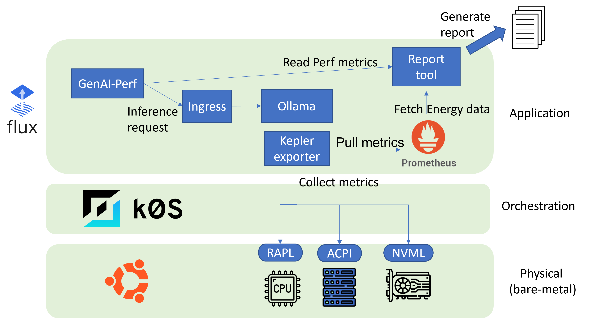

# ITPE
LLM Inference Testbed for Performance & Energy

## Architecture


## Tested platform
- Home cluster
  - Debian 12 with k0s 1.32.4

## Prerequisites

You will need a Kubernetes cluster version 1.28 or newer.
For a quick local test, you can use [Kubernetes kind](https://kind.sigs.k8s.io/docs/user/quick-start/).
Any other Kubernetes setup will work as well though.

In order to follow the guide you'll need a GitHub account and a
[personal access token](https://help.github.com/en/github/authenticating-to-github/creating-a-personal-access-token-for-the-command-line)
that can create repositories (check all permissions under `repo`).
Or you can use fine-grained Github token following [this](https://fluxcd.io/flux/installation/bootstrap/github/#github-organization).

Install the CLI by downloading precompiled binaries using a Bash script:

```sh
curl -s https://fluxcd.io/install.sh | sudo bash
```

## Bootstrap cluster

The clusters dir contains the Flux configuration (`home` and `lab`):

**Fork** this repository on your personal GitHub account and export your GitHub access token, username and repo name:

```sh
export GITHUB_TOKEN=<your-token>
export GITHUB_USER=<your-username>
export GITHUB_REPO=ITPE
```

Verify that your home cluster satisfies the prerequisites with:

```sh
flux check --pre
```

Bootstrap Flux with home cluster if using fine-grained Github token:

```sh
flux bootstrap github \
    --token-auth \
    --owner=${GITHUB_USER} \
    --repository=${GITHUB_REPO} \
    --branch=main \
    --personal \
    --path=clusters/home
```

Or using Github PAT:

```sh
flux bootstrap github \
    --owner=${GITHUB_USER} \
    --repository=${GITHUB_REPO} \
    --branch=main \
    --personal \
    --path=clusters/home
```

The bootstrap command commits the manifests for the Flux components in `clusters/home/flux-system` dir
and creates a deploy key with read-only access on GitHub, so it can pull changes inside the cluster.

Watch for the Helm releases being installed on home:

```console
$ watch flux get helmreleases --all-namespaces

NAMESPACE       NAME            REVISION        SUSPENDED       READY   MESSAGE
metallb-system  metallb         0.15.2          False           True
monitoring      prometheus      76.4.1          False           True
ollama          ollama          1.27.0          False           True
traefik         traefik         37.0.0          False           True
```

Bootstrap Flux on lab by setting the context and path to your lab cluster:

```sh
flux bootstrap github \
    --owner=${GITHUB_USER} \
    --repository=${GITHUB_REPO} \
    --branch=main \
    --personal \
    --path=clusters/lab
```
